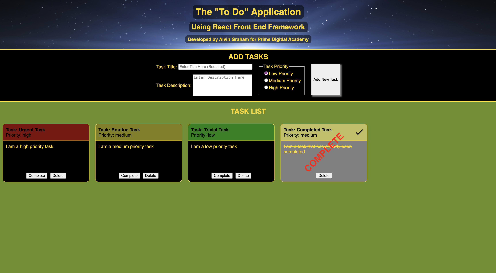

# WEEKEND-SQL-TO-DO-REACT

# Prime React To Do Project Using React Framework

## Description

_Duration: 2 weeks_

This project is a solution to the Prime Digital Academy weekend challenge of the same name. The end product meets all specs for baseline and stretch goals. The code challenge instructions are found [here](./INSTRUCTIONS.md).

Everyone needs a little help reminding them of the day to day and long term tasks that they need to accomplish, and sometimes a full blown calendar app is just a little too much. This lightweight app is a handy way to keep track of such tasks.

To complete this project I used the following checklist to break the problem down into steps.

Application Creation Steps

- [x] Create Initial Database in PostgreSQL
- [x] Create Server side server, router, and pool modules
- [x] Create and test server GET route
- [x] Create and test server POST routebasic styling
- [x] Create and test server PUT route
- [x] Create and test server DELETE route
- [x] Update App component and identify state variables
- [x] Implement and test client GET route
- [x] Create Header component
- [x] Create AddTasks component
- [x] Create and style add task form
- [x] Implement and test client POST route
- [x] Create DisplayTasks component
- [x] Implement TaskCard component creation logic
- [x] Create TaskCard component
- [x] Implement TaskCard behavior logic and conditional formatting
- [x] Implement and test client PUT and DELETE routes
- [x] Integrate routes into TaskCard button logic
- [x] Review and update css styles and formatting (including minor use of MaterialUI)

My initial strategy was to complete all functional tasks first, then go back and restyle to make it visually appealing (function over form). In reality it turned out to be a more iterative process of incremental function, then form, then more function, then more form, etc...

For additional styling, I decided to add a priority category for each task, and assign a color code to each priority that would display as part of the banner of each TaskCard for easy reference. I couldn't help but to make it crystal clear that I task was complete by greying out the description field, applying a check mark to the top right corner of each card, and a very conspicuous COMPLETE stamp on each card.

## Screen Shot

Screen Shot

### Prerequisites

- [Node.js](https://nodejs.org/en/)
- [express](https://expressjs.com/)
- [React](https://react.dev/)

## Installation

1. Open up your editor of choice and run an `npm install`
2. Initiate the server using `npm run server`
3. Initiate the client using `npm run client`
4. navigate to host ip and port in browser (e.g. `127.0.0.1:5173`)
5. Enjoy!!!

## Usage

- To add a task, simply fill out the form including a short task title, a task description, and choose a priority, then click the `Add New Task` button or press `Enter`. The database comes pre-loaded with four dummy tasks (for demonstration purposes) that can be immediately deleted.
- Each task is displayed by a rectangular task card with a title field, a description field, and a pair of buttons. All completed tasks will automatically sort to the end of the list.

  - The title field includes the tasks short title, the priority, and is color coded according to the task priority (green, yellow, and red). If the short title is of significant length, the size of the field will grow.

  - The description field is the long description of the task including any details you might have entered.

  - The `Complete` button marks the task as commplete, causing all text to be struck through, the description field to turn grey, a completion check mark to appear in the upper right corner, the removal of the complete button, and an obvious COMPLETE stamp. It will be clear that a task is complete. This cannot currently be undone.

  - The `Delete` button will remove the task from the server and database. This action is permenant and cannot be undone.

## Built With

1. Server Side

- Node.js
- javascript
- express
- postgreSQL

2. Client Side

- HTML
- CSS
- javascript
- Axios
- React
- Material UI (a little)

## Acknowledgement

Thanks to [Prime Digital Academy](www.primeacademy.io) who equipped and helped me to make this application a reality. (Thank your people)
